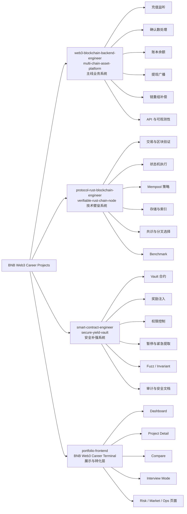
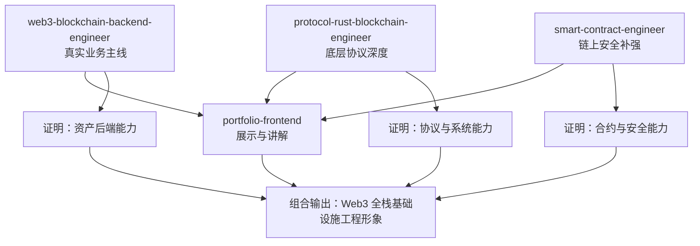

# BNB 项目模块总览图与能力地图

## 1. 文档定位

本文档用于从全局视角说明 `BNB` 仓库的模块结构、模块关系、能力覆盖范围与岗位映射关系，帮助读者快速理解：

- 这个仓库由哪些模块组成
- 每个模块分别解决什么问题
- 各模块之间如何形成完整叙事
- 这些模块共同证明了哪些商业与技术能力

---

## 2. 仓库总览

`BNB` 不是单一业务系统，而是一个围绕 Web3 求职与能力展示构建的组合型项目仓库。

它由四个核心模块构成：

1. `web3-blockchain-backend-engineer`
2. `protocol-rust-blockchain-engineer`
3. `smart-contract-engineer`
4. `portfolio-frontend`

其中前三个模块分别对应三条技术主线，前端模块负责把这些成果组织成可展示、可讲解、可面试演示的产品界面。

---

## 3. 模块总览图



---

## 4. 模块分层图

从仓库职责来看，可以把四个模块理解为四层：

```text
第 1 层：业务主线层
  web3-blockchain-backend-engineer
  目标：证明自己能做真实的 Web3 资产后端系统

第 2 层：底层协议层
  protocol-rust-blockchain-engineer
  目标：证明自己理解节点、状态执行、验证与协议边界

第 3 层：链上安全层
  smart-contract-engineer
  目标：证明自己不仅懂链下系统，也理解链上资产与安全模型

第 4 层：展示转化层
  portfolio-frontend
  目标：把前三层内容组织成可面试、可讲解、可视化的产品
```

---

## 5. 各模块职责说明

### 5.1 `web3-blockchain-backend-engineer`

项目定位：多链资产后端平台，是整个仓库最接近真实商业系统的一条主线。

核心模块：

- `rpcgateway`：RPC provider 管理、失败切换、批量请求
- `scanner`：区块扫描、日志拉取、checkpoint 推进
- `parser`：ERC-20 Transfer 解析与充值识别
- `confirmworker`：确认数推进、充值状态流转
- `ledgerservice`：账本流水与余额快照
- `withdrawalservice`：提现申请、冻结与状态管理
- `broadcaster`：交易构造、nonce 分配、广播重试
- `reorgdetector`：链重组检测与补偿
- `api`：对外查询与操作接口

业务价值：

- 对应钱包、Custody、交易所、支付、清结算类后端场景
- 能展示“链上事件 -> 链下资产状态 -> 用户余额 -> 提现执行”的完整闭环

能力信号：

- 后端架构设计
- 分布式一致性与幂等
- 链上链下对账思维
- 资产安全与可审计性
- API 与监控体系建设

### 5.2 `protocol-rust-blockchain-engineer`

项目定位：最小可验证区块链节点，是技术壁垒模块。

核心模块：

- `types`：交易、区块、收据、账户等核心数据结构
- `crypto`：哈希、签名验证、地址派生
- `state`：账户状态与状态根
- `executor`：交易执行与区块执行
- `mempool`：nonce 排序、fee 优先级、替换策略
- `validation`：区块与根校验
- `storage`：链数据与状态存储
- `consensus`：PoA 与基础 fork choice
- `rpc`：查询与提交接口

业务价值：

- 不直接面向终端业务，而是强化底层基础设施与协议理解能力
- 更适合 Protocol、Infra、Node、Execution、MEV 相关岗位叙事

能力信号：

- Rust 系统编程
- 状态机与确定性执行
- 区块验证与导入流程
- 节点内部模块边界设计
- 性能分析与 benchmark 意识

### 5.3 `smart-contract-engineer`

项目定位：安全导向收益金库合约，是链上安全补强模块。

核心模块：

- `SecureYieldVault.sol`：主金库合约
- `RewardDistributor.sol`：奖励分发与 timelock 操作
- `mocks/*`：恶意代币、重入攻击、特殊资产行为模拟
- `test/*`：单元测试、不变量测试、安全测试
- `docs/SECURITY.md`：威胁模型与安全策略
- `docs/AUDIT_REPORT.md`：审计式输出

业务价值：

- 不是追求复杂 DeFi 业务，而是强调“资产类合约如何安全地设计与验证”
- 适合展示对 DeFi 风险、权限、舍入、暂停、紧急处理的系统理解

能力信号：

- Solidity 工程能力
- Vault / shares-assets 模型理解
- 安全测试体系
- 权限边界设计
- 审计视角表达能力

### 5.4 `portfolio-frontend`

项目定位：组合项目展示前端，是整个仓库的产品包装层和转化层。

核心页面：

- `Dashboard`
- `ProjectDetail`
- `Compare`
- `InterviewMode`
- `AssetDashboard`
- `OpsConsole`
- `ProtocolVisualizer`
- `SecurityLab`
- `RiskCenter`
- `Wallet / Market / Trading`

业务价值：

- 将抽象的工程成果可视化
- 降低 HR、招聘经理、面试官的理解成本
- 把“代码能力”转化成“展示能力”和“说服能力”

能力信号：

- 前端信息架构设计
- 技术产品包装能力
- 数据可视化与多视角表达
- 面试叙事设计能力

---

## 6. 模块关系图



---

## 7. 能力地图

### 7.1 一级能力地图

| 能力域 | 具体能力 | 对应模块 |
|---|---|---|
| 业务系统能力 | 充值、提现、账本、交易生命周期、资金闭环 | `web3-blockchain-backend-engineer` |
| 基础设施能力 | RPC 容灾、异步任务、可观测性、补偿机制 | `web3-blockchain-backend-engineer` |
| 协议底层能力 | 交易验证、状态执行、区块导入、分叉处理 | `protocol-rust-blockchain-engineer` |
| 系统编程能力 | Rust、存储、性能、数据结构 | `protocol-rust-blockchain-engineer` |
| 链上工程能力 | Vault、权限、奖励、资产份额模型 | `smart-contract-engineer` |
| 安全工程能力 | 重入防护、权限边界、fuzz、invariant、审计表达 | `smart-contract-engineer` |
| 展示与表达能力 | 可视化、信息架构、面试演示、项目包装 | `portfolio-frontend` |

### 7.2 二级能力地图

| 细分能力 | 表现形式 | 对应模块 |
|---|---|---|
| 幂等设计 | 充值事件唯一键、提现幂等键、账本唯一约束 | `web3-blockchain-backend-engineer` |
| 一致性设计 | 账本驱动余额、反向流水补偿、冻结与扣减分离 | `web3-blockchain-backend-engineer` |
| 链重组处理 | 保存 block hash、识别 orphan、重扫与修正 | `web3-blockchain-backend-engineer` |
| 交易执行建模 | nonce、余额、gas、receipt、执行结果 | `protocol-rust-blockchain-engineer` |
| 节点验证意识 | 重新执行区块、不信任外部 root、校验 parent/root | `protocol-rust-blockchain-engineer` |
| 状态确定性 | 相同输入得到相同状态根 | `protocol-rust-blockchain-engineer` |
| 安全建模 | CEI、ReentrancyGuard、Pausable、AccessControl | `smart-contract-engineer` |
| 测试深度 | unit、fuzz、invariant、attack PoC | `smart-contract-engineer` |
| 技术传播 | Dashboard、项目对比、面试模式、风险视图 | `portfolio-frontend` |

---

## 8. 岗位映射图

```text
Web3 Backend / Wallet Backend / Asset Platform
  -> web3-blockchain-backend-engineer 为主
  -> smart-contract-engineer 为补强

Protocol Engineer / Rust Blockchain Engineer
  -> protocol-rust-blockchain-engineer 为主
  -> web3-blockchain-backend-engineer 为落地补强

Smart Contract Engineer / DeFi Security
  -> smart-contract-engineer 为主
  -> web3-blockchain-backend-engineer 展示链下协作能力

Technical Product Demo / 面试展示 / 个人品牌包装
  -> portfolio-frontend
```

---

## 9. 仓库的组合价值

从单模块看：

- `web3-blockchain-backend-engineer` 证明真实业务后端能力
- `protocol-rust-blockchain-engineer` 证明底层协议与系统深度
- `smart-contract-engineer` 证明链上安全与合约工程能力
- `portfolio-frontend` 证明产品包装与表达能力

从组合上看，这个仓库构成了一条完整能力链：

```text
链上数据理解
-> 资产系统建模
-> 节点与协议验证
-> 合约安全控制
-> 项目展示与讲解
```

这意味着 `BNB` 仓库展示的不是单点技能，而是一种跨层能力：

- 能理解底层链的运行方式
- 能构建链下资产服务系统
- 能识别链上资金模型的安全边界
- 能把复杂工程成果转化成可沟通、可展示、可面试的产品

---

## 10. 总结

`BNB` 仓库可以被概括为一个四模块协同的 Web3 能力展示系统：

- `web3-blockchain-backend-engineer` 是主线业务模块
- `protocol-rust-blockchain-engineer` 是技术壁垒模块
- `smart-contract-engineer` 是安全补强模块
- `portfolio-frontend` 是展示转化模块

如果从能力地图角度总结，这个仓库最终证明的是五类核心能力：

1. Web3 资产后端能力
2. Rust 协议与节点能力
3. Solidity 与安全工程能力
4. 分布式系统与可观测性能力
5. 项目表达、包装与面试转化能力

因此，`BNB` 不是一个孤立项目，而是一套围绕 Web3 职业定位构建的模块化能力证明体系。
